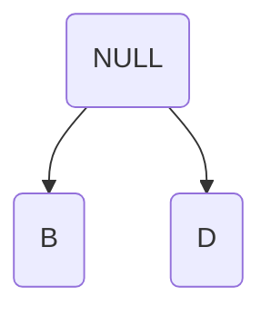
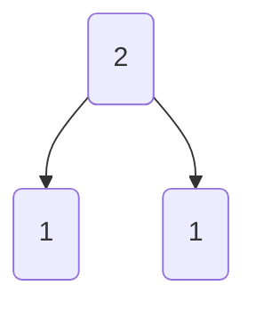
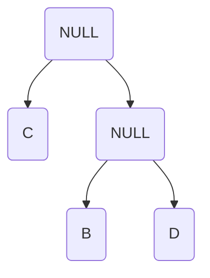
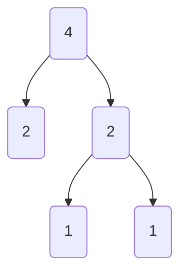
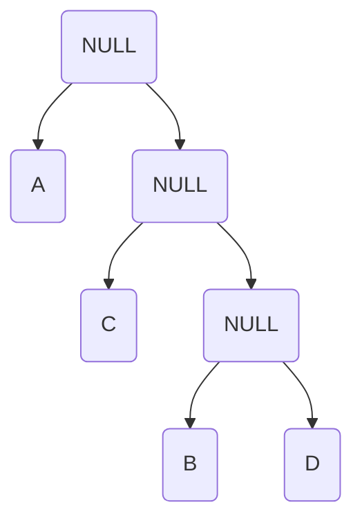
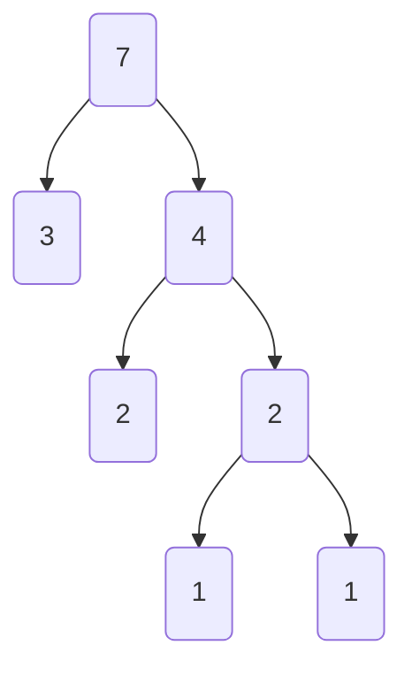
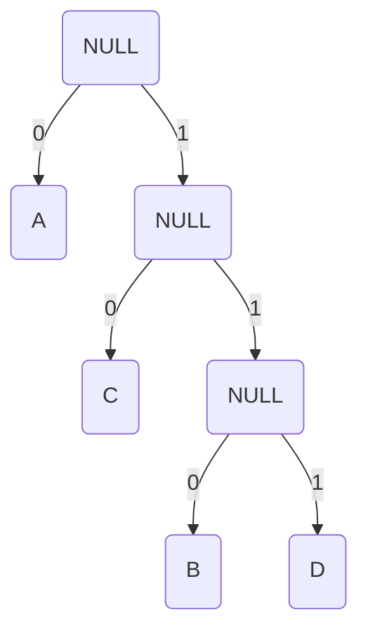

# 哈夫曼编码
## 1.哈夫曼编码的原理
> 设有一段字符 ABAACDC  
> 若考虑二异性[^1]进行编码，结果如下：  
> A:00  
> B:01  
> C:10  
> D:11  
> 这虽然有效，但非压缩率最高的方法，于是我们引入哈夫曼编码  
> 首先，我们要计算每个字符出现的频率  
> A:3次 B:1次 C:2次 D:1次  
> 执行如下步骤：  
> 找出出现频率最少的两个字符，这段中最少的是B和D，将其设为子结点,他们的权值[^2]为出现次数  
> 同时设立一个无实义结点，其权值为


###### 上图为字符，下图为权值
> 找出除上面已经出现过的字符外出现频率最少的一个字符，这段中最少的是C  
> 与上一个无实义结点同设为孩子结点，再设立一个无实义结点


> 反复重复这一操作  


> 此时，设左孩子为0，右孩子为1，每个结点的编码即为经过的路径

> A: 0
> C: 10
> B: 110
> D: 111
> 此时的压缩率最高且不会出现二异性
## 2.哈夫曼编码的实现
> 结点部分:  
``` C++  
#define Elemtype char
typedef struct Node
{
    Elemtype data;      //代表结点的字符
    int weight;         //结点的权值
    Node* LeftChild;    //结点的左孩子
    Node* RightChild;   //结点的右孩子
}Node, *Nodes;
```
>类部分：  
``` c++
class Huffman
{
private:
    Elemtype a[MaxSize];                  //字符数组
    int b[MaxSize];                       //权值数组
    char c[MaxSize][MaxSize];             //编码数组(每一行都是一段哈夫曼编码)
    int size = 0;
public:
    void Creat();                         //创建函数,并对数组进行处理
    void CreatTree();                     //对后两个结点先处理
    void HuffmanTree(Nodes q, int i);     //对其他结点进行处理
    void HufftoCode(Elemtype st[]);       //哈夫曼编码
    void CodetoHuff(char code[]);         //哈夫曼解码
};
```  
>各函数部分
``` c++ 
/*创建函数,并对数组进行处理*/
void Huffman::Creat()
{
    Elemtype aCopy[MaxSize];//我们自然要对最开始输入的字符串进行处理,先复制
    int bCopy[MaxSize];
    int i, j, k;
    Elemtype t;
    /*输入数组*/
    cin >> t;
    for (i = 0; i < MaxSize && t != '#'; i++, size++)
    {
        a[i] = t;
        cin >> t;
    }
    for (i = 0; i < size; i++)
    {
        b[i] = 1;
    }
    /*数组复制*/
    for (i = 0; i < size; i++)
    {
        aCopy[i] = a[i];
        bCopy[i] = b[i];
    }
    cout << "size:" << size << endl;
    aCopy[i] = '\0';
    int protosize = size;
    /*压缩数组,确保字符数组的唯一性，并保存出现次数*/
    for (i = 0; i < size; i++)
    {
        for (j = i - 1; j >= 0; j--)
        {
            if (a[i] == a[j])
            {
                for (k = i; k <= size; k++)
                {
                    a[k] = a[k + 1];
                }
                b[j] += 1;
                size -= 1;
                i -= 1;
                break;
            }
        }
    }
    /*数组排序*/
    for (i = 0; i < size; i++)
    {
        k = i;
        for (j = i + 1; j < size; j++)
        {
            if (b[j] > b[i])
            {
                int p;
                Elemtype o;
                p = b[i]; o = a[i];
                b[i] = b[j]; a[i] = a[j];
                b[j] = p; a[j] = o;
            }
        }
    }
    
    for (i = 0; i < size; i++)
    {
        cout << a[i] << ' ' << b[i] << ' ' << endl;
    }
    /*调用造树函数*/
    CreatTree();
    for (i = 0; i < size; i++)
    {
        cout << a[i]<< ':';
        for (j = 0; c[i][j] != '\0'; j++)
        {
            cout << c[i][j];
        }
        cout << endl;
    }
    /*调用编码函数*/
    HufftoCode(aCopy);
    cout << endl;
}
```  
``` c++
/*造树，并优先处理最后两个结点*/
void Huffman::CreatTree()
{
    if (size >= 3)
    {
        Nodes o, p, q;
        o = new Node;
        p = new Node;
        q = new Node;
        p->data = a[size - 2];
         q->data = a[size - 1];
        p->weight = b[size - 2];
         q->weight = b[size - 1];
        
        c[size - 2][0] = '0';
        c[size - 2][1] = '\0';
        c[size - 1][0] = '1';
        c[size - 1][1] = '\0';
        
        p->LeftChild = NULL;
         q->LeftChild = NULL;
        p->RightChild = NULL;
         q->RightChild = NULL;

        o->data = NULL;
        o->weight = p->weight + q->weight;
        o->LeftChild = p;
        o->RightChild = q;
        
        HuffmanTree(o, size - 3);
    }
}
```  

[^1]: 同一段编码有两种解释。如A:1 B:0 C:10. 若用编码10，则不能确定其为C还是AB  

[^2]: 权值本身可以自定义，这里为方便理解定义为字符的出现频率