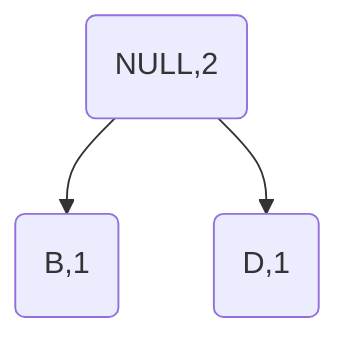
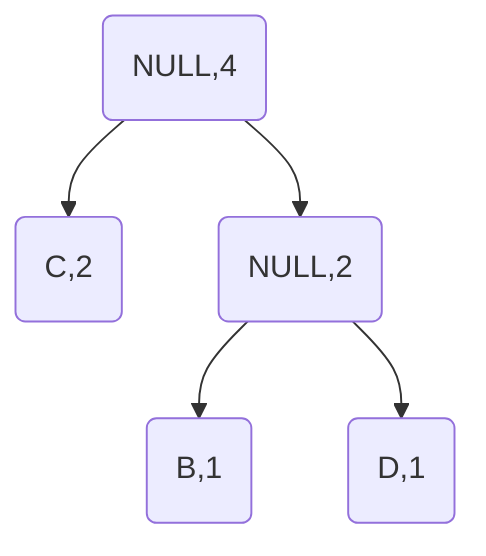
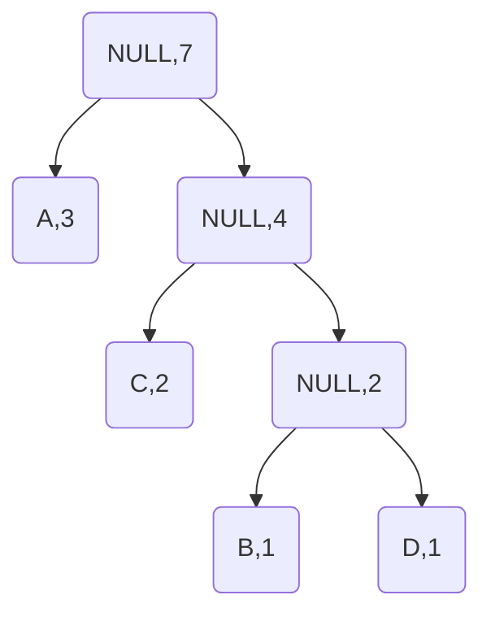
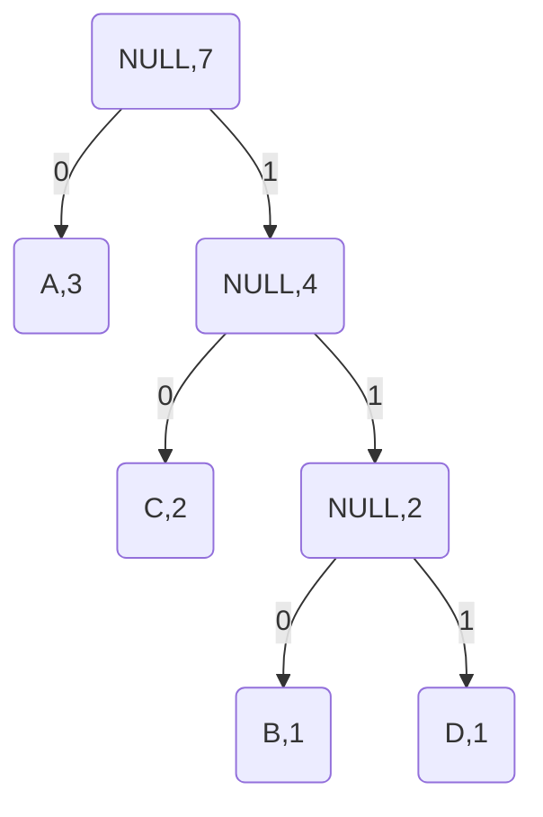

# 哈夫曼编码
## 1.哈夫曼编码的原理
> 设有一段字符 ABAACDC  
> 若考虑二异性进行编码，结果如下：  
> A:00  
> B:01  
> C:10  
> D:11  
> 这虽然有效，但非压缩率最高的方法，于是我们引入哈夫曼编码  
> 首先，我们要计算每个字符出现的频率  
> A:3次 B:1次 C:2次 D:1次  
> 执行如下步骤：  
> 找出出现频率最少的两个字符，这段中最少的是B和D，将其设为子结点,他们的权值[^1]为出现次数  
> 同时设立一个无实义结点，其权值为

> 找出除上面已经出现过的字符外出现频率最少的一个字符，这段中最少的是C  
> 与上一个无实义结点同设为孩子结点，再设立一个无实义结点

> 反复重复这一操作  

> 结果为

## 2.哈夫曼编码的实现
[^1]:权值本身可以自定义，这里为方便理解定义为字符的出现频